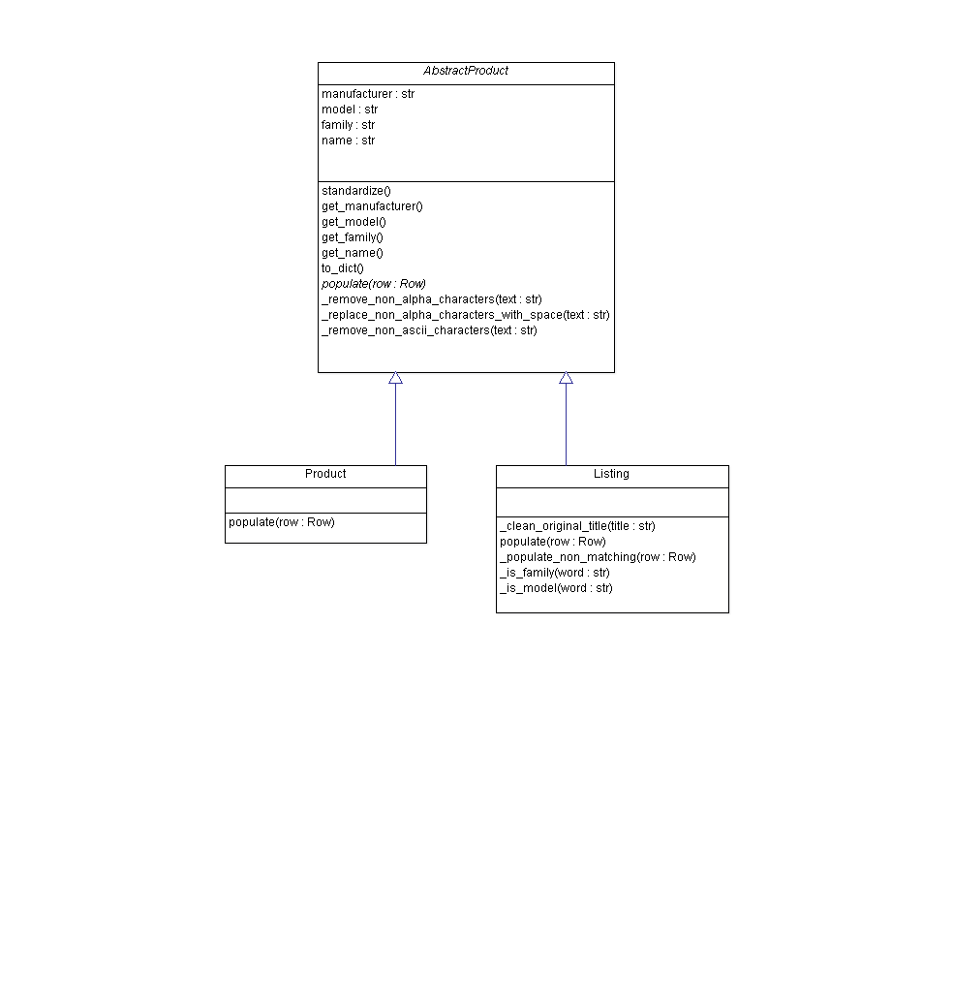

This repository contains my submission for the
[Sortable coding challenge](http://sortable.com/challenge/).

# Quick Start Instructions
Assuming Java is already installed, these instructions will run the matching program on a single node Spark cluster

1. Clone this repository with `git clone https://github.com/yuguang/sortable.git`
3. Hadoop is a dependency for Spark. Install Hadoop, replacing `ubuntu` with your username

        wget http://apache.mirrors.tds.net/hadoop/common/hadoop-2.7.1/hadoop-2.7.1.tar.gz
        sudo tar zxvf hadoop-* -C /usr/local
        sudo mv /usr/local/hadoop-* /usr/local/hadoop
        sudo chown -R ubuntu /usr/local/hadoop
    
4. Install Spark to `/usr/local` by replacing `ubuntu` with your username and running
    
        wget http://apache.mirror.gtcomm.net/spark/spark-1.6.2/spark-1.6.2-bin-hadoop2.6.tgz
        sudo tar zxvf spark-1.6.2-bin-hadoop2.6.tgz -C /usr/local
        sudo mv /usr/local/spark-* /usr/local/spark
        sudo chown -R ubuntu /usr/local/spark

2. `cd sortable` to move into the project's root directory
5. Install dependencies by running `./setup-virtualenv.sh`
5. Run `./run.sh`
6. Results will be saved in `data_output/matchings.txt`.
7. Optionally, run unittests on the core classes
 
        cd src
        python3 model.py

# Methodology
Before starting this project, I researched the existing literature on Record Linkage and Entity Resolution. The problem of determining whether two pieces of information from disparate data sources are referencing the same same product is well studied. There were papers and libraries from several years ago. I decided to use the [dedupe](https://github.com/datamade/dedupe) Python library because it implements algorithms from recent literature. However, using such a library instead of rolling my own with Spark MLlib comes with drawbacks. Among the obvious drawbacks are performance degradation and conversion of formats. 
 
 In order to fit the dedupe library into the Spark framework, I am using Spark for preprocessing and post processing before and after running Entity Resolution algorithms. Spark reads in JSON lines, maps them to Listing and Product objects, then converts them to dictionaries with fields for the dedupe library. I train the model for a many to one mapping of listings to products. Then I use the model to identify records that all refer to the same entity. Because the dedupe library returns pairs of product and listing matchings, I post process results to collect together listings under the same products. 
 
## Training Data
 For training the record linkage algorithm, I made training datasets `data_training/listings.txt` and `data_training/products.txt`. The lines within these files are taken directly from their respective files in `data_input`. The script `process_training_data.py` processes the raw training data to write in a JSON format readable by the dedupe library. `process_training_data.py` reuses the classes I wrote for products and listings to convert them to dictionaries. 

## Data Cleaning
For record linkage algorithms to work more effectively, I split listing data into separate fields. These fields are manufacturer, family, name, and model. The major advantage of comparing field by field is that the algorithm does not treat each field string distance equally. Behind the scenes, record linkage algorithms assign different weights to each field.  

Listings have inconsistent capitalization. My classes for products and listings return lowercased fields for manufacturer, family, and model. For product_name and title which are stored as the `name` field in their classes, I remove hyphens and punctuation. 

## Class Structure
I have two classes, `Product` and `Listing`, all inheriting from an `AbstractProduct` class. `AbstractProduct` is an abstract base class. `Product` and `Listing` are concrete implementations. Concrete classes also implement the `populate` method, which takes a Spark DataFrame row and sets the respective attributes. Listings only have the manufacturer field in the JSON. Therefore, the `populate` method is implemented by two separate classes.   

